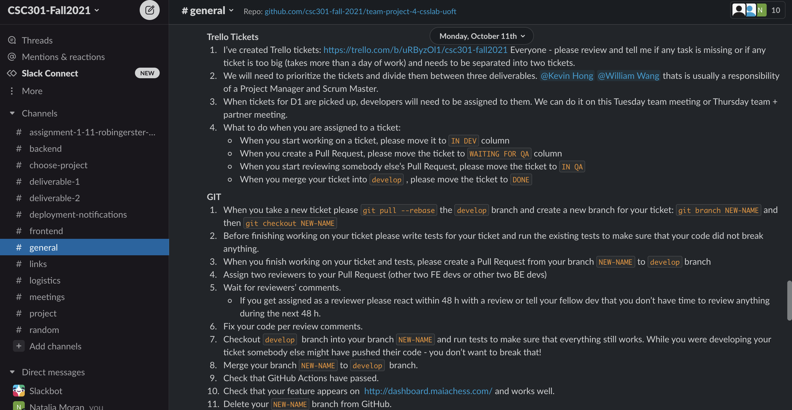
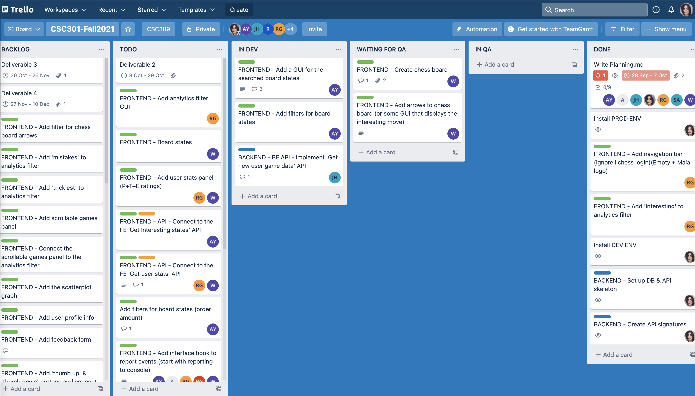

# Maia Dashboard / anti-semicolon-semicolon-club

> _Note:_ This document is intended to be relatively short. Be concise and precise. Assume the reader has no prior knowledge of your application and is non-technical. 

## Description 
 * Provide a high-level description of your application and it's value from an end-user's perspective
 * What is the problem you're trying to solve?
 * Is there any context required to understand **why** the application solves this problem?

## Key Features
For this deliverable, below is the complete set of features an user can access. Note that this features are connected with backend.
* Searching for interesting moves
  * After selecting "interesting" in the filter column, the page will search for interesting moves and display the result under the positions column.
* Searching for tricky moves
  * After selecting "tricky" in the filter column, the page will search for tricky moves and display the result under the positions column.
* Searching for mistakes
  * After selecting "mistakes" in the filter column, the page will search for mistakes moves and display the result under the positions column.
* Viewing a board state on the chessboard
  * The user can choose to view any of the board states by clicking on it. The state will then display on the chessboard.
* Viewing suggestions from the AIs
  * When a board state is displayed on the chessboard, arrows representing the suggestions by the AIs will be displayed as well. Each color representing the suggested move from a different AIs.
  
## Instructions
 * Clear instructions for how to use the application from the end-user's perspective
 * How do you access it? Are accounts pre-created or does a user register? Where do you start? etc. 
 * Provide clear steps for using each feature described above
 * This section is critical to testing your application and must be done carefully and thoughtfully

**Maia Dashboard website:** http://dashboard.maiachess.com/

**Maia Dashboard API docs:** http://dashboard.maiachess.com/api/docs 
 
## Development requirements
## Local environment installation guidelines
### Dependencies
In order to run this you need the following installed:
* docker
* python3.8
* virtualenv

### Clone project
Clone the project repository:
```
git clone git@github.com:csc301-fall-2021/team-project-4-csslab-uoft.git
```

### Create virtualenv
Follow instructions in `scripts/setup_local.sh` - run them from the project's top directory.

### Running mongodb container 
Install Docker and run from the top directory of the project:
```
docker-compose up
```
To test that it works, go to `http://localhost:27017` in your browser,
You should see a message: `It looks like you are trying to access MongoDB over HTTP on the native driver port.`.

If you do not see this message, something is wrong starting mongodb container.

If you want to reset the local mongo database: 
1. Terminate the `docker-compose` process.
2. Delete all files from `mongo_data` using this command:
   ```
   rm -rf mongo_data/*
   ```
   Notice there is a hidden file `.gitkeep` so the directory will be created when pulling from git - 
   Do not delete this file.

### Running backend
You can either run the server from the command line using this command from the `backend` directory:
```
uvicorn main:app --host 0.0.0.0 --port 8000
```

Or alternatively, you can run the `main.py` using your IDE.
If you wish to change the port the app is running on, you can change this line in `main.py`
```
uvicorn.run(app, host="0.0.0.0", port=8000) # << Change port
```

If you want your FastAPI to point to a different mongo database, you 
can set an environment variable `MONGODB_URL` to where you have your mongodb instance.

To check that your backend works, go to `http://localhost:8000/api/docs` - you should see the 
FastAPI openapi doc.

### Running frontend

From the `frontend` directory, run 
```
npm install
npm start
```
This will start the react app locally. 

 
 ## Deployment and Github Workflow

Before starting development our team agreed on a set of rules for working together. 


### Development environment deployment process 
We chose to adapt the following deployment process to recreate the best practices 
that we have seen in the IT industry during our co-op terms and full-time jobs 
as software developers, project managers and system analysts.

We believe in preventing conflicts by communicating with each other; 
our workflow is set to make each developer's working process as transparent as possible to other team members.
* Before starting developing we created a backlog of tasks in Trello 
and chose tickets for Deliverable-2 together with the partner.

* When a developer is assigned to a new task, she/he clarifies task requirements written in a Trello ticket.
* When a developer starts working on a new task, she/he moves the Trello ticket for this task to `IN DEV` column.
* The developer pulls updates from the `develop` branch: `git pull --rebase`
* The developer creates and checkouts a new branch for the task: 
```
git branch NEW-BRANCH
git checkout NEW-BRANCH
```
* While implementing the new functionality, the developer adds tests for it.
* Before creating a Pull Request the developer runs all tests to ensure that their code did not break any other functionality.
* When the new functionality is finalized and all tests pass, the developer creates a Pull Request from their branch `NEW-BRANCH` to `develop` branch.
* The developer assigns two reviewers to their Pull Request (other two frontend devs or other two backend devs) and moves the ticket to `WAITING FOR QA` column in Trello.
* Within 48h the reviewers should give their feedback on the Pull Request. 
While a developer is reviewing other developer's Pull Request, they move the Trello ticket to the `IN QA` column. 
* After receiving a code review feedback, the developer fixes their code in accordance with the review comments.
* The developer checkouts `develop` branch into their branch `NEW-BRANCH` and runs tests to make sure that everything still works 
(there might have been changes in the `develop` branch while the developer was working on their ticket).
* The developer merges their branch `NEW-BRANCH` to `develop` branch.
* The developer checks that GitHub Actions have passed.
* The developer checks that their feature is deployed to the [development environment](http://dash-dev.maiachess.com/) and works well there.
* The developer deletes their `NEW-BRANCH` branch from GitHub and moves the Trello ticket to the `DONE` column.


### Production environment deployment process 
Once in a few days Natalia (or other developer) merges `develop` branch into `main` branch 
and checks that all functionality works well in the [production environment](http://dashboard.maiachess.com/).

### CI/CD
During the Deliverable-1 we planned the CI/CD pipeline flow. 
We implemented the CI/CD as planned, using GitHub Actions and Azure hosting provided by the partner.

The only difference is that we used `uvicorn` instead of `gunicorn` service.

The following diagram was created for Deliverable-1 and used as a guideline for CI/CD development during Deliverable-2.

[![](https://mermaid.ink/img/eyJjb2RlIjoiZmxvd2NoYXJ0IFRCXG4gICAgc3ViZ3JhcGggZGphbmdvW1Rlc3QgUHl0aG9uIGNvZGUgYW5kIGRlcGxveSBiYWNrZW5kXVxuICAgICAgICBkaXJlY3Rpb24gVEJcbiAgICAgICAgZGVwZW5kZW5jaWVzW0luc3RhbGwgcHl0aG9uIGRlcGVuZGVuY2llc10gLS0-IHRlc3RzW1J1biB0ZXN0c11cbiAgICAgICAgdGVzdHMgLS0-IGNvcHlbQ29weSBiYWNrZW5kL3B5dGhvbiBmaWxlc11cbiAgICAgICAgY29weSAtLT4gZ3VuaWNvcm5bUmVzdGFydCBndW5pY29ybiBzZXJ2aWNlIG9uIHNlcnZlcl1cbiAgICBlbmRcbiAgICBzdWJncmFwaCByZWFjdFtCdWlsZCBmcm9udGVudCBhbmQgZGVwbG95XVxuICAgICAgICBkaXJlY3Rpb24gVEJcbiAgICAgICByZWFjdF9kZXBlbmRlbmNpZXNbSW5zdGFsbCByZWFjdCBkZXBlbmRlbmNpZXNdIC0tPiBidWlsZFtSZWFjdCBidWlsZF1cbiAgICAgICBidWlsZCAtLT4gY29weV9mZVtDb3B5IHJlYWN0IGJ1aWxkIHRvIHNlcnZlcl1cbiAgICBlbmRcbiAgICBzdWJncmFwaCBzbGFja1tTbGFjayBub3RpZmljYXRpb25dXG4gICAgICAgIHhbTm90aWZ5IG9uIHN1Y2Nlc3NmdWwgZGVwbG95bWVudF1cbiAgICAgICAgLVtOb3RpZnkgb24gZGVwbG95bWVudCBmYWlsdXJlXVxuICAgICAgICBcbiAgICBlbmRcbiAgICB1c2VyW0RldmVsb3Blcl0gLS0-fHB1c2ggY29kZXwgZ2l0aHViW0dpdEh1YiA8YnIvPiBkZXZlbG9wICYgbWFzdGVyIDxici8-IGJyYW5jaGVzXVxuICAgIGdpdGh1YiAtLT58Z2l0aHViIGFjdGlvbiBqb2IgMXwgZGphbmdvXG4gICAgZ2l0aHViIC0tPnxnaXRodWIgYWN0aW9uIGpvYiAyfCByZWFjdFxuICAgIFxuICAgIHJlYWN0IC0tPiBzbGFja1xuICAgIGRqYW5nbyAtLT4gc2xhY2tcblxuICAgIGNvcHlfZmUgLS4tIGNvbW1lbnRbRW52aXJvbm1lbnQgZGVwZW5kYW50IG9uIGJyYW5jaF1cbiAgICBjb3B5IC0uLSBjb21tZW50XG4gICAgZ3VuaWNvcm4gLS4tIGNvbW1lbnRcbiAgIiwibWVybWFpZCI6eyJ0aGVtZSI6ImRhcmsifSwidXBkYXRlRWRpdG9yIjpmYWxzZSwiYXV0b1N5bmMiOnRydWUsInVwZGF0ZURpYWdyYW0iOmZhbHNlfQ)](https://mermaid.live/edit/#eyJjb2RlIjoiZmxvd2NoYXJ0IFRCXG4gICAgc3ViZ3JhcGggZGphbmdvW1Rlc3QgUHl0aG9uIGNvZGUgYW5kIGRlcGxveSBiYWNrZW5kXVxuICAgICAgICBkaXJlY3Rpb24gVEJcbiAgICAgICAgZGVwZW5kZW5jaWVzW0luc3RhbGwgcHl0aG9uIGRlcGVuZGVuY2llc10gLS0-IHRlc3RzW1J1biB0ZXN0c11cbiAgICAgICAgdGVzdHMgLS0-IGNvcHlbQ29weSBiYWNrZW5kL3B5dGhvbiBmaWxlc11cbiAgICAgICAgY29weSAtLT4gZ3VuaWNvcm5bUmVzdGFydCBndW5pY29ybiBzZXJ2aWNlIG9uIHNlcnZlcl1cbiAgICBlbmRcbiAgICBzdWJncmFwaCByZWFjdFtCdWlsZCBmcm9udGVudCBhbmQgZGVwbG95XVxuICAgICAgICBkaXJlY3Rpb24gVEJcbiAgICAgICByZWFjdF9kZXBlbmRlbmNpZXNbSW5zdGFsbCByZWFjdCBkZXBlbmRlbmNpZXNdIC0tPiBidWlsZFtSZWFjdCBidWlsZF1cbiAgICAgICBidWlsZCAtLT4gY29weV9mZVtDb3B5IHJlYWN0IGJ1aWxkIHRvIHNlcnZlcl1cbiAgICBlbmRcbiAgICBzdWJncmFwaCBzbGFja1tTbGFjayBub3RpZmljYXRpb25dXG4gICAgICAgIHhbTm90aWZ5IG9uIHN1Y2Nlc3NmdWwgZGVwbG95bWVudF1cbiAgICAgICAgLVtOb3RpZnkgb24gZGVwbG95bWVudCBmYWlsdXJlXVxuICAgICAgICBcbiAgICBlbmRcbiAgICB1c2VyW0RldmVsb3Blcl0gLS0-fHB1c2ggY29kZXwgZ2l0aHViW0dpdEh1YiA8YnIvPiBkZXZlbG9wICYgbWFzdGVyIDxici8-IGJyYW5jaGVzXVxuICAgIGdpdGh1YiAtLT58Z2l0aHViIGFjdGlvbiBqb2IgMXwgZGphbmdvXG4gICAgZ2l0aHViIC0tPnxnaXRodWIgYWN0aW9uIGpvYiAyfCByZWFjdFxuICAgIFxuICAgIHJlYWN0IC0tPiBzbGFja1xuICAgIGRqYW5nbyAtLT4gc2xhY2tcblxuICAgIGNvcHlfZmUgLS4tIGNvbW1lbnRbRW52aXJvbm1lbnQgZGVwZW5kYW50IG9uIGJyYW5jaF1cbiAgICBjb3B5IC0uLSBjb21tZW50XG4gICAgZ3VuaWNvcm4gLS4tIGNvbW1lbnRcbiAgIiwibWVybWFpZCI6IntcbiAgXCJ0aGVtZVwiOiBcImRhcmtcIlxufSIsInVwZGF0ZUVkaXRvciI6ZmFsc2UsImF1dG9TeW5jIjp0cnVlLCJ1cGRhdGVEaWFncmFtIjpmYWxzZX0)
 

 ## Licenses 

 Keep this section as brief as possible. You may read this [Github article](https://help.github.com/en/github/creating-cloning-and-archiving-repositories/licensing-a-repository) for a start.

 * What type of license will you apply to your codebase?
 * What affect does it have on the development and use of your codebase?
 * Why did you or your partner make this choice?
